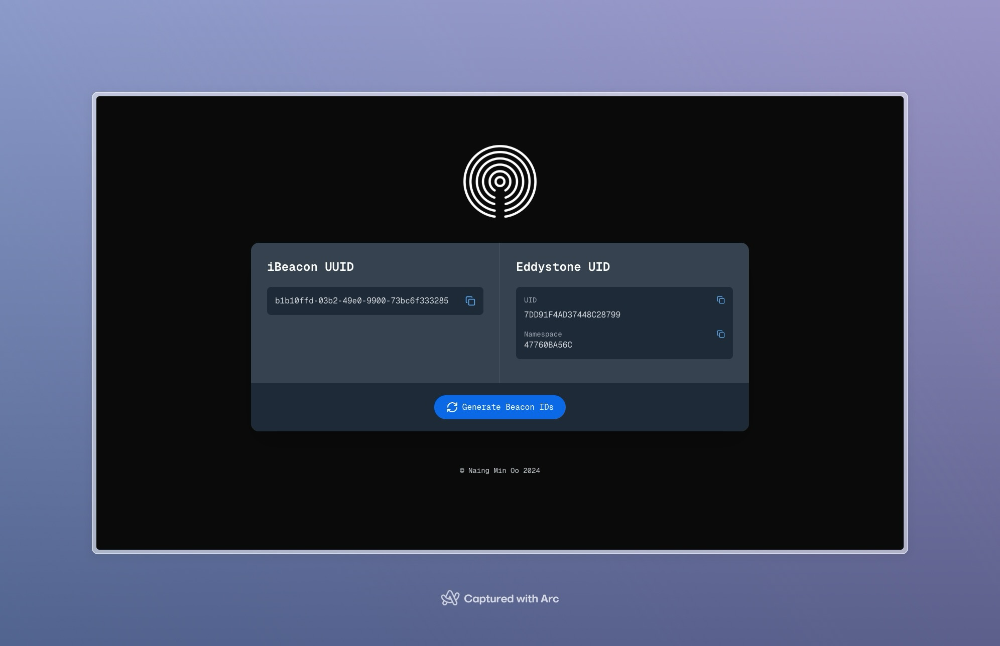

# Beacon ID Generator

**Beacon ID Generator** is a web application built with [Next.js](https://nextjs.org) that allows users to effortlessly generate iBeacon UUIDs, Eddystone UIDs, and Namespace IDs. Whether you're developing Bluetooth beacons or managing beacon networks, this tool provides a simple and intuitive interface to create unique identifiers essential for beacon deployment and management.

## Table of Contents

- [Features](#features)
- [Demo](#demo)
- [Getting Started](#getting-started)
  - [Prerequisites](#prerequisites)
  - [Installation](#installation)
- [Usage](#usage)
- [Technologies Used](#technologies-used)
- [Project Structure](#project-structure)
- [Customization](#customization)
- [Deployment](#deployment)
- [Contributing](#contributing)
- [License](#license)
- [Acknowledgements](#acknowledgements)

## Features

- **iBeacon UUID Generation:** Easily generate universally unique identifiers (UUIDs) for iBeacons.
- **Eddystone UID & Namespace IDs:** Generate Eddystone UIDs and Namespace IDs for Eddystone-compatible beacons.
- **Copy to Clipboard:** Instantly copy generated IDs with a single click.
- **Dark Mode Support:** Automatically adapts to your system's dark mode settings for a seamless experience.
- **Responsive Design:** Optimized for various devices, ensuring usability on desktops, tablets, and mobile phones.

## Demo

*Visual representation of the Beacon ID Generator interface.*

## Getting Started

Follow these instructions to set up and run the Beacon ID Generator project locally on your machine.

### Prerequisites

Ensure you have the following installed on your machine:

- [Node.js](https://nodejs.org/en/) (v14 or later)
- [npm](https://www.npmjs.com/) or [Yarn](https://yarnpkg.com/)
- [Git](https://git-scm.com/)
